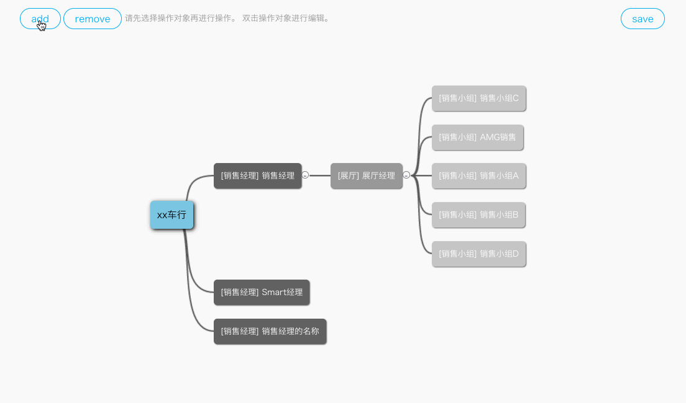

Mind Map
======

## Notice

This repo that convert original lib to typescript lib, then, add some feature, hope you like this feature.

## Original

jsMind 是一个显示/编辑思维导图的纯 javascript 类库，其基于 html5 的 canvas 进行设计。jsMind 以 BSD 协议开源，在此基础上你可以在你的项目上任意使用。你可以在此浏览[适用于 jsMind 的 BSD 许可协议(中英文版本)][3]。

jsMind is a pure javascript library for mindmap, it base on html5 canvas. jsMind was released under BSD license, you can embed it in any project, if only you observe the license. You can read [the BSD license agreement for jsMind in English and Chinese version][3] here.

## Install 

> npm install mind-map

## Feature

### Configurable node tree depth etc.

> we can add property depth of option parameter to control this mind map depth, it will throw exception when add node greater the depth.

```javascript
const option = {
  ...
  depth: 5,
  hasInteraction: true,
  enableDraggable: true,
}

const mindMap = MindMapMain.show(option, mind);
```

By above example, we create a mind map that support 5 level depth, 
define the select option is `销售经理`, `展厅`, `销售小组` and 
support interaction(but now, we only support interaction with the last level option, that's mean when we select the last option like `销售小组`,
 we can receive event from the mind map transporter.
  Likewise, we can initiative send event to the mind map by the mind map receiver)

* hasInteraction(boolean): define this mind map whether need interaction, if true, we can use some utils like reporter and receiver to control yourself interaction
* enableDraggable(boolean): enable node draggable, default is false


### Configurable node select type.

> we can add property hierarchy_rule of option parameter to control this mind map select type and node background color and font color.

```javascript
const HIERARCHY_RULES = {
  ROOT: {
    name: 'XX汽车有限公司',
    backgroundColor: '#7EC6E1',
    getChildren: () => [
      HIERARCHY_RULES.SALES_MANAGER,
      HIERARCHY_RULES.SHOW_ROOM,
      HIERARCHY_RULES.SALES_TEAM
    ]
  },
  SALES_MANAGER: {
    name: '销售经理',
    color: '#fff',
    backgroundColor: '#616161',
    getChildren: () => [
      HIERARCHY_RULES.SHOW_ROOM,
      HIERARCHY_RULES.SALES_TEAM
    ]
  },
  SHOW_ROOM: {
    name: '展厅',
    color: '#fff',
    backgroundColor: '#989898',
    getChildren: () => [
      HIERARCHY_RULES.SALES_TEAM
    ]
  },
  SALES_TEAM: {
    name: '销售小组',
    color: '#fff',
    backgroundColor: '#C6C6C6',
    getChildren: () => []
  }
};
```

By above example, we can configurate the mind map hierarchical relationship.

* name(string): display in node text
* color(string): node font color
* backgroundColor(string): node background color
* getChildren(function): get can select node type in selector


## Usage

In angular2,

```javascript

import { MindMapMain } from 'mind-map';

const HIERARCHY_RULES = {
  ROOT: {
    name: 'XX汽车有限公司',
    backgroundColor: '#7EC6E1',
    getChildren: () => [
      HIERARCHY_RULES.SALES_MANAGER,
      HIERARCHY_RULES.SHOW_ROOM,
      HIERARCHY_RULES.SALES_TEAM
    ]
  },
  SALES_MANAGER: {
    name: '销售经理',
    color: '#fff',
    backgroundColor: '#616161',
    getChildren: () => [
      HIERARCHY_RULES.SHOW_ROOM,
      HIERARCHY_RULES.SALES_TEAM
    ]
  },
  SHOW_ROOM: {
    name: '展厅',
    color: '#fff',
    backgroundColor: '#989898',
    getChildren: () => [
      HIERARCHY_RULES.SALES_TEAM
    ]
  },
  SALES_TEAM: {
    name: '销售小组',
    color: '#fff',
    backgroundColor: '#C6C6C6',
    getChildren: () => []
  }
};

const option = {
  container: 'jsmind_container',
  theme: 'normal',
  editable: true,
  depth: 4,
  hierarchyRule: HIERARCHY_RULES
};

const mind = {
  "format": "nodeTree",
    "data": {
      "id": 43,
      "topic": "xx车行",
      "selectedType": false,
      "backgroundColor": "#7EC6E1",
      "children": [
        {
          "id": 80,
          "color": "#fff",
          "topic": "show room",
          "direction": "right",
          "selectedType": "销售经理",
          "backgroundColor": "#616161",
          "children": []
        },
        {
          "id": 44,
          "color": "#fff",
          "topic": "销售经理",
          "direction": "right",
          "selectedType": "销售经理",
          "backgroundColor": "#616161",
          "children": [
            {
              "id": 46,
              "color": "#fff",
              "topic": "展厅经理",
              "direction": "right",
              "selectedType": "展厅",
              "backgroundColor": "#989898",
              "children": [
                {
                  "id": 49,
                  "color": "#fff",
                  "topic": "销售小组C",
                  "direction": "right",
                  "selectedType": "销售小组",
                  "backgroundColor": "#C6C6C6",
                  "children": []
                },
                {
                  "id": 51,
                  "color": "#fff",
                  "topic": "AMG销售",
                  "direction": "right",
                  "selectedType": "销售小组",
                  "backgroundColor": "#C6C6C6",
                  "children": []
                },
                {
                  "id": 47,
                  "color": "#fff",
                  "topic": "销售小组A",
                  "direction": "right",
                  "selectedType": "销售小组",
                  "backgroundColor": "#C6C6C6",
                  "children": []
                },
                {
                  "id": 48,
                  "color": "#fff",
                  "topic": "销售小组B",
                  "direction": "right",
                  "selectedType": "销售小组",
                  "backgroundColor": "#C6C6C6",
                  "children": []
                },
                {
                  "id": 50,
                  "color": "#fff",
                  "topic": "销售小组D",
                  "direction": "right",
                  "selectedType": "销售小组",
                  "backgroundColor": "#C6C6C6",
                  "children": []
                }
              ]
            }
          ]
        },
        {
          "id": 45,
          "color": "#fff",
          "topic": "Smart经理",
          "direction": "right",
          "selectedType": "销售经理",
          "backgroundColor": "#616161",
          "children": []
        }
      ]
    }
};


@Component(
  ...
)
class MindMapComponent implements OnInit {

  mindMap;

  constructor() {

  }

  ngOnInit() {
    this.mindMap = MindMapMain.show(option, mind);
  }

  removeNode() {
    const selectedNode = this.mindMap.getSelectedNode();
    const selectedId = selectedNode && selectedNode.id;

    if (!selectedId) {
      return;
    }
    this.mindMap.removeNode(selectedId);
  }

  addNode() {
    const selectedNode = this.mindMap.getSelectedNode();
    if (!selectedNode) {
      return;
    }

    const nodeId = customizeUtil.uuid.newid();
    this.mindMap.addNode(selectedNode, nodeId);
  }

  getMindMapData() {
    const data = this.mindMap.getData().data;
    console.log('data: ', data);
  }
}

```


